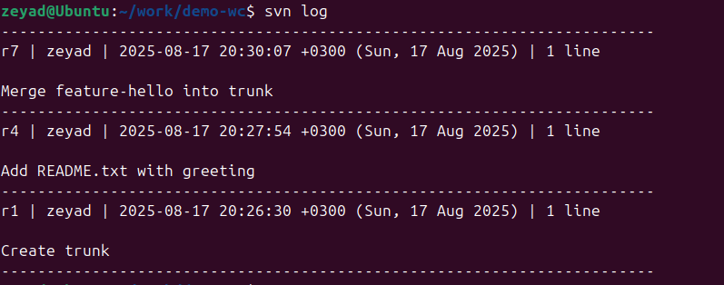

# SVN (Apache Subversion) — Beginner-Friendly Guide for DevOps Learners

## What is SVN?
SVN (Apache Subversion) is a centralized **version control system** that tracks changes to files and folders over time. Teams use it to collaborate safely, maintain history, and ship software with confidence.

## Why do DevOps & software teams use SVN?
- **Single Source of Truth:** A central repository ensures everyone pulls from the same place.
- **Change History & Auditing:** Every change is recorded with author, time, and message.
- **Stable Release Lines:** Trunk/branches/tags support release management and hotfixes.
- **Access Control:** Centralized auth and permissions are straightforward to manage.
- **Works with Binary Assets:** Common in legacy or enterprise workflows (e.g., docs, design files).

---

## Core Concepts & Keywords
- **Repository (repo):** Central database storing all files and history.
- **Working Copy:** Your local checkout of the repository files.
- **Trunk:** The main line of development (like `main` in Git).
- **Branch:** A copy of code for isolated work (features, experiments, hotfixes).
- **Tag:** A read-only snapshot (e.g., `v1.0`) for releases/milestones.
- **Checkout (`svn checkout`):** Create a local working copy from the repo.
- **Update (`svn update`):** Pull the latest changes into your working copy.
- **Add (`svn add`):** Stage a new file/folder for versioning.
- **Commit (`svn commit`):** Save (publish) your changes to the repository.
- **Revert (`svn revert`):** Discard local changes in your working copy.
- **Merge (`svn merge`):** Bring changes from one branch (or revision range) into another.
- **Resolve:** Fix conflicts when the same lines changed in parallel.
- **Revision:** A global version number for the entire repository state.
- **SVN Layout (convention):** Top-level `trunk/`, `branches/`, `tags/` folders.

---

## Minimal Hands-On Demo (Local, Lightweight)

> Goal: Create a local SVN repository, add a file, commit, branch, and merge—no server required.  
> Prerequisite: Install the Subversion CLI (e.g., `svn` and `svnadmin`).

### 1) Create a local repository

svnadmin create /tmp/demo-svn-repo
svn mkdir file:///tmp/demo-svn-repo/trunk -m "Create trunk"
svn mkdir file:///tmp/demo-svn-repo/branches -m "Create branches"
svn mkdir file:///tmp/demo-svn-repo/tags -m "Create tags"

### 2) Checkout the trunk
mkdir -p ~/work && cd ~/work
svn checkout file:///tmp/demo-svn-repo/trunk demo-wc
cd demo-wc

### 3) Add and commit a file
echo "# Hello SVN" > README.txt
svn add README.txt
svn commit -m "Add README.txt with greeting"

### 4) Create a branch and merge
# Create branch
svn copy file:///tmp/demo-svn-repo/trunk \
         file:///tmp/demo-svn-repo/branches/feature-hello \
         -m "Create feature branch"

# Work on branch
svn checkout file:///tmp/demo-svn-repo/branches/feature-hello feature-wc
cd feature-wc
echo "Added from branch" >> README.txt
svn commit -m "Update README in branch"

# Merge back into trunk
cd ~/work/demo-wc
svn merge ^/branches/feature-hello
svn commit -m "Merge feature-hello into trunk"

### 5) Create a tag
svn copy file:///tmp/demo-svn-repo/trunk \
         file:///tmp/demo-svn-repo/tags/v0.1 \
         -m "Tag v0.1 release"

### Example Outputs

  ## SVN Log
    Shows the history of commits for a file or project.
    

  ## SVN Blame 
    Shows which user last modified each line of a file.
    

